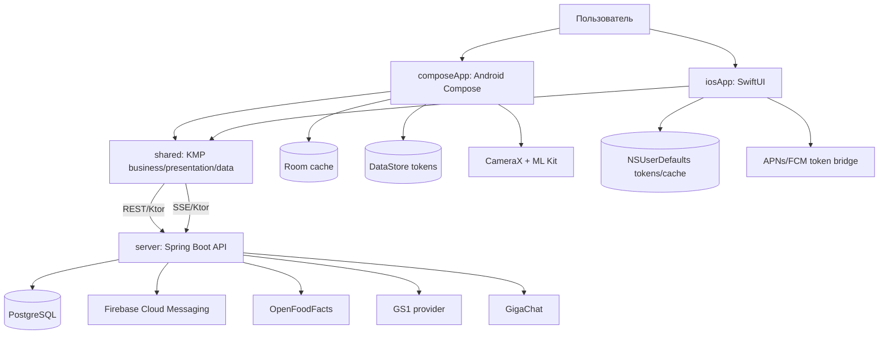
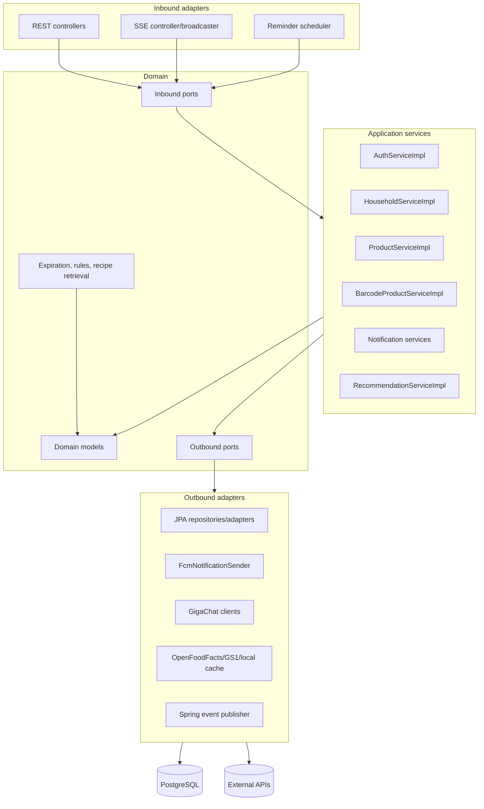
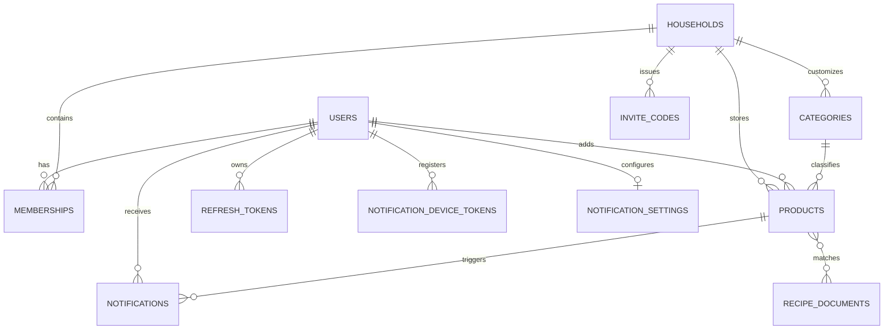
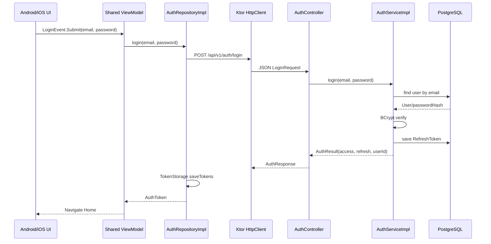
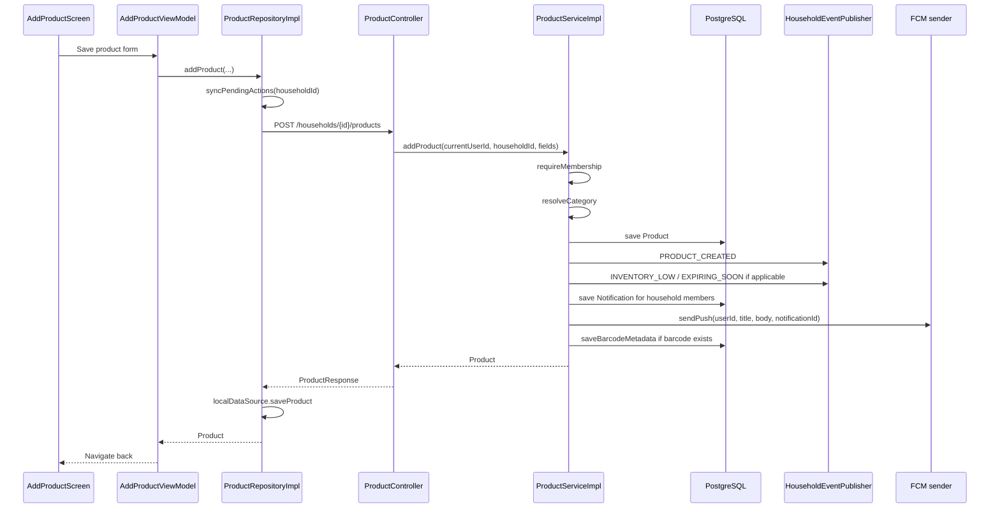
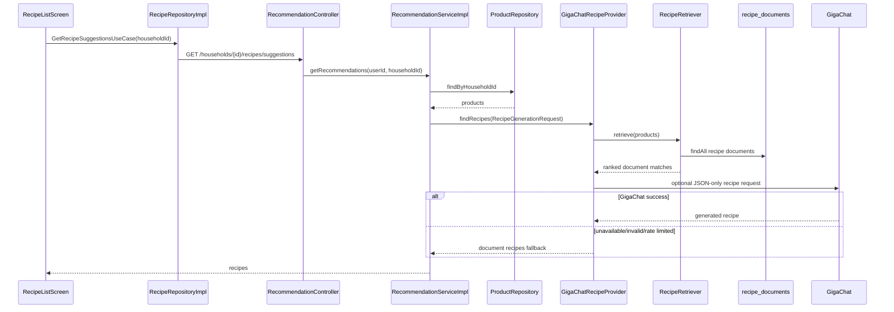
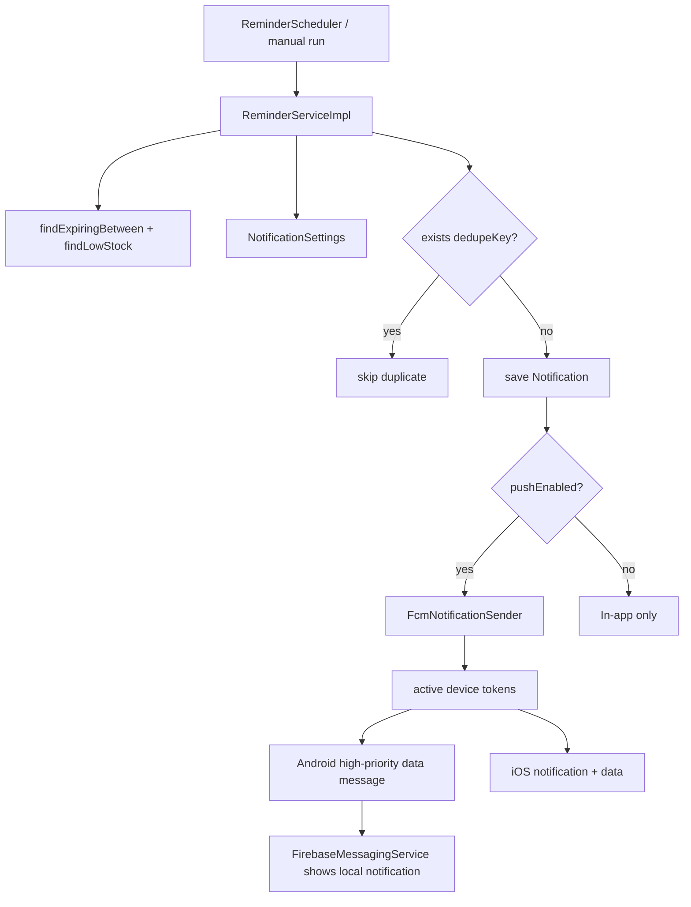
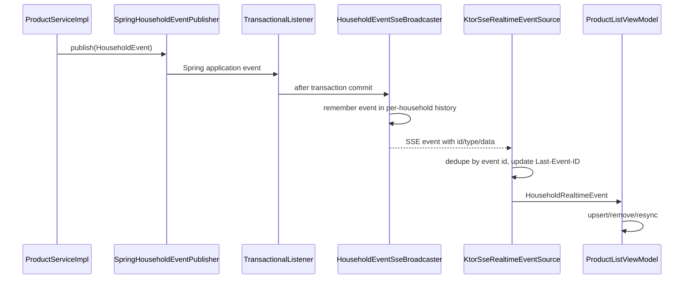
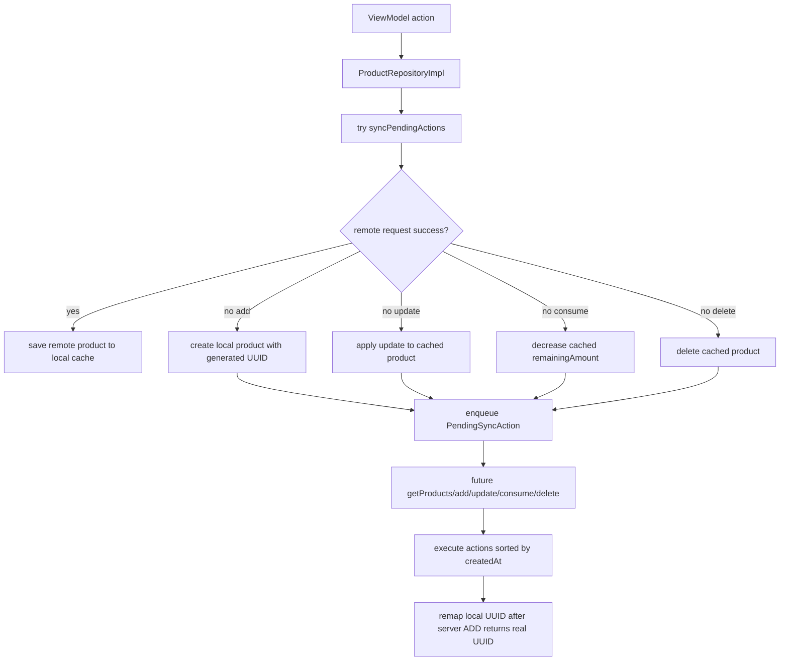

# ProductInventory: финальное описание проекта, архитектуры и потоков

## 1. Назначение проекта

`ProductInventory` - это кроссплатформенное приложение для совместного учета домашних продуктов. Оно решает типичную бытовую проблему: продукты покупаются разными членами семьи, часть запасов забывается, сроки годности пропускаются, остатки не синхронизируются между устройствами, а идеи для блюд появляются слишком поздно. Проект объединяет мобильное приложение, серверную часть, базу данных, realtime-синхронизацию, push-уведомления, офлайн-кеш, сканирование штрихкодов, подсказки категорий и рецептов.

Ключевые сценарии:

- Пользователь регистрируется, входит в систему и получает пару `accessToken`/`refreshToken`.
- Пользователь создает домохозяйство или присоединяется по invite-коду.
- Участники домохозяйства добавляют, редактируют, расходуют и удаляют продукты.
- Список продуктов обновляется между устройствами через SSE-события.
- Android-приложение хранит локальный кеш в Room и очередь офлайн-действий.
- Пользователь сканирует штрихкод через CameraX/ML Kit, получает черновик продукта из кеша, OpenFoodFacts, GS1, локальной базы или пустую форму.
- Backend обогащает продукт категорией, пищевой ценностью и нормализованными полями через GigaChat, rule-based fallback и дефолтную категорию.
- Backend создает напоминания о близком сроке годности и малом остатке.
- Backend хранит in-app notifications и отправляет push через Firebase Cloud Messaging.
- Android получает high-priority data-message в фоне, показывает локальное уведомление и дедуплицирует его с foreground polling fallback.
- Пользователь получает рецепты по текущим запасам: сначала retrieval по документам рецептов в PostgreSQL, затем GigaChat-генерация при доступной конфигурации, иначе fallback на найденные документы.

Проект состоит из четырех основных частей:

- `server` - Spring Boot backend на Kotlin.
- `shared` - Kotlin Multiplatform модуль с общей сетевой, доменной, data и presentation логикой.
- `composeApp` - Android-приложение на Jetpack Compose, Room, CameraX, ML Kit и Firebase Messaging.
- `iosApp` - SwiftUI-приложение, использующее KMP framework `Shared`.

## 2. Технологический стек

| Слой | Технологии | Почему выбрано |
|---|---|---|
| Backend | Kotlin, Spring Boot 3.4.5, Spring Web, Spring Security, Spring Data JPA, Flyway, PostgreSQL, Jackson Kotlin, JJWT | Spring Boot дает зрелую экосистему для REST, безопасности, транзакций и миграций. Kotlin сохраняет единый язык с мобильной бизнес-логикой. |
| База данных | PostgreSQL, Flyway migrations `V1`-`V9` | PostgreSQL подходит для реляционной предметной области: пользователи, домохозяйства, продукты, категории, уведомления, refresh-токены. Flyway делает эволюцию схемы воспроизводимой. |
| Shared mobile | Kotlin Multiplatform, Coroutines, Ktor 3.4.3, Koin 4.0.4, kotlinx.serialization, kotlinx.datetime | Общие repository/use case/ViewModel сокращают дублирование между Android и iOS. |
| Android | Compose Multiplatform/Jetpack Compose, Navigation Compose, Room, DataStore, CameraX, ML Kit Barcode Scanning, Firebase Messaging | Compose дает декларативный UI, Room - надежный локальный кеш, DataStore - безопасное key-value хранение токенов, CameraX/ML Kit - нативное сканирование штрихкодов. |
| iOS | SwiftUI, KMP framework `Shared`, Firebase/APNs bridge, NSUserDefaults | SwiftUI сохраняет нативный iOS UX, а shared ViewModel и use cases обеспечивают одинаковые правила приложения. |
| AI/внешние источники | GigaChat, OpenFoodFacts, GS1, Firebase Cloud Messaging | GigaChat используется как улучшение, а не единственная точка отказа. OpenFoodFacts/GS1 дают данные по штрихкодам. FCM нужен для фоновых push на Android/iOS. |

## 3. Общая карта модулей



### Почему такая модульная структура

`shared` вынесен отдельно, потому что основной набор сценариев одинаков для Android и iOS: авторизация, домохозяйства, продукты, категории, barcode draft, уведомления, профиль, рецепты и realtime. Если бы вся логика была продублирована в Android Kotlin и Swift, пришлось бы дважды реализовывать:

- обработку ошибок API;
- refresh access token;
- маппинг DTO в доменные модели;
- офлайн-синхронизацию продуктов;
- state machine экранов;
- правила фильтрации продуктов;
- обработку realtime events;
- тесты бизнес-логики.

В текущем подходе Android и iOS различаются только UI, платформенными хранилищами, push/token bridge и локальными реализациями, а бизнес-логика находится в одном месте.

## 4. Backend архитектура

Backend построен как Clean/Hexagonal architecture. В проекте это не академическое разделение ради терминологии, а практический способ отделить бизнес-правила от REST, JPA, FCM, GigaChat и внешних barcode-провайдеров.



### Backend layers

`domain/model` содержит предметные сущности: `User`, `Household`, `Membership`, `Product`, `Quantity`, `ExpirationDate`, `Category`, `Notification`, `NotificationSettings`, `NotificationDeviceToken`, `HouseholdEvent`, `Recipe`, `RecipeDocument`, barcode draft models. Это модели бизнес-смысла, а не JPA-сущности.

`domain/port/inbound` задает use-case контракты: `IAuthService`, `IHouseholdService`, `IProductService`, `ICategoryService`, `IBarcodeProductService`, `IProductEnrichmentService`, `IRecommendationService`, `INotificationService`, `INotificationPreferencesService`, `IReminderService`, `IUserService`.

`domain/port/outbound` задает зависимости, которые нужны приложению, но реализация которых находится во внешнем мире: repository-порты, `INotificationSender`, `IHouseholdEventPublisher`, `IRecipeProvider`, `IRecipeKnowledgeRepository`, barcode cache/provider ports, GigaChat category client.

`application/service` реализует use cases. Например:

- `AuthServiceImpl` регистрирует пользователя, проверяет пароль, создает access JWT и refresh token, ротирует refresh token.
- `HouseholdServiceImpl` управляет домохозяйствами, membership, invite code, join/leave/remove, уведомлениями о новом участнике.
- `ProductServiceImpl` добавляет, обновляет, расходует, удаляет продукты, проверяет membership, публикует события, создает уведомления, сохраняет barcode metadata в cache.
- `CategoryServiceImpl` работает с системными и пользовательскими категориями.
- `BarcodeProductServiceImpl` строит цепочку провайдеров barcode draft и применяет подсказку категории.
- `ProductEnrichmentServiceImpl` выбирает категорию и дополнительные поля через GigaChat, rule matcher или fallback.
- `ReminderServiceImpl` находит продукты с близким сроком/низким остатком, применяет настройки пользователя, дедуплицирует уведомления и отправляет push.
- `RecommendationServiceImpl` получает продукты домохозяйства и вызывает recipe provider.

`infrastructure/adapter/inbound/rest` открывает HTTP API. Контроллеры тонкие: читают `currentUserId()`, валидируют request DTO через Bean Validation, вызывают inbound port и маппят результат в response DTO.

`infrastructure/adapter/outbound/persistence` реализует repository-порты через Spring Data JPA. Доменные модели не аннотированы `@Entity`, поэтому инфраструктурные `*Entity` и `EntityMapper.kt` отделяют форму таблиц от бизнес-моделей.

`infrastructure/adapter/outbound/fcm`, `.../ai`, `.../barcode`, `.../recipe` скрывают внешние API за портами. Благодаря этому сервисы не зависят от HTTP-деталей GigaChat, FCM или OpenFoodFacts.

### Почему hexagonal лучше простого Controller-Service-Repository

Простой слой `Controller -> Service -> Repository` быстрее стартует, но в этом проекте быстро стал бы смешивать:

- правила membership и access control;
- REST DTO;
- JPA entities;
- внешние API barcode/AI;
- FCM payload;
- SSE eventing;
- миграционные детали базы.

Hexagonal separation дает преимущества:

- backend можно тестировать на уровне application service без поднятия HTTP и PostgreSQL;
- внешние клиенты можно заменить fake/stub реализациями;
- доменная модель не зависит от JPA lifecycle;
- FCM, GigaChat, OpenFoodFacts и GS1 остаются заменяемыми адаптерами;
- новые входы, например CLI scheduler или другой API, могут использовать те же inbound ports.

## 5. Backend HTTP API

| Область | Endpoint | Назначение |
|---|---|---|
| Health | `GET /health` | Проверка готовности backend. |
| Auth | `POST /api/v1/auth/register` | Регистрация пользователя и выдача токенов. |
| Auth | `POST /api/v1/auth/login` | Вход по email/password. |
| Auth | `POST /api/v1/auth/refresh` | Ротация refresh token и выдача новой пары токенов. |
| Households | `POST /api/v1/households` | Создание домохозяйства. |
| Households | `GET /api/v1/households` | Список домохозяйств пользователя. |
| Households | `GET /api/v1/households/{householdId}` | Детали домохозяйства. |
| Households | `GET /api/v1/households/{householdId}/members` | Участники. |
| Households | `POST /api/v1/households/{householdId}/invite` | Invite-код. |
| Households | `POST /api/v1/households/join` | Вступление по invite-коду. |
| Households | `DELETE /api/v1/households/{householdId}/members/{memberId}` | Удаление участника владельцем. |
| Households | `POST /api/v1/households/{householdId}/leave` | Выход из домохозяйства. |
| Products | `POST /api/v1/households/{householdId}/products` | Добавление продукта. |
| Products | `GET /api/v1/households/{householdId}/products` | Список продуктов, опционально по категории. |
| Products | `GET /api/v1/households/{householdId}/products/{productId}` | Детали продукта. |
| Products | `PUT /api/v1/households/{householdId}/products/{productId}` | Редактирование. |
| Products | `POST /api/v1/households/{householdId}/products/{productId}/consume` | Расходование части продукта. |
| Products | `DELETE /api/v1/households/{householdId}/products/{productId}` | Удаление. |
| Products | `GET /api/v1/households/{householdId}/products/expiring` | Продукты с близким сроком. |
| Barcode | `GET /api/v1/households/{householdId}/barcodes/{barcode}` | Новый barcode draft lookup. |
| Barcode legacy | `POST /api/v1/households/{householdId}/products/barcode` | Legacy добавление продукта по barcode через сервис. |
| Categories | `GET /api/v1/households/{householdId}/categories` | Системные и пользовательские категории. |
| Categories | `POST /api/v1/households/{householdId}/categories` | Создание пользовательской категории. |
| Categories | `PUT /api/v1/households/{householdId}/categories/{categoryId}` | Переименование пользовательской категории. |
| Categories | `DELETE /api/v1/households/{householdId}/categories/{categoryId}` | Архивация пользовательской категории. |
| Enrichment | `POST /api/v1/households/{householdId}/products/enrichment/suggest` | Подсказка категории/полей продукта. |
| Recipes | `GET /api/v1/households/{householdId}/recipes` и `/suggestions` | Рецепты по текущим запасам. |
| Notifications | `GET /api/v1/notifications` | Все уведомления пользователя. |
| Notifications | `GET /api/v1/notifications/unread` | Непрочитанные уведомления. |
| Notifications | `PUT /api/v1/notifications/{notificationId}/read` | Пометить одно уведомление прочитанным. |
| Notifications | `PUT /api/v1/notifications/read-all` | Пометить все прочитанными. |
| Preferences | `GET /api/v1/notifications/preferences` | Настройки уведомлений. |
| Preferences | `PUT /api/v1/notifications/preferences` | Обновление настроек. |
| Device tokens | `POST /api/v1/notifications/preferences/device-tokens` | Регистрация FCM/APNs token. |
| Device tokens | `DELETE /api/v1/notifications/preferences/device-tokens/{tokenId}` | Деактивация token. |
| Reminders | `POST /api/v1/households/{householdId}/notifications/reminders/run` | Ручной запуск напоминаний по домохозяйству. |
| Realtime | `GET /api/v1/households/{householdId}/events` | SSE stream. |
| Realtime | `GET /api/v1/households/{householdId}/events/missed` | Догрузка пропущенных событий после `Last-Event-ID`. |
| Profile | `GET /api/v1/profile` | Профиль пользователя. |
| Profile | `PUT /api/v1/profile` | Обновление профиля. |

## 6. Схема данных и миграции

Flyway хранит историю схемы в `server/src/main/resources/db/migration`.

| Миграция | Смысл |
|---|---|
| `V1__baseline_schema.sql` | Базовые таблицы: `users`, `households`, `memberships`, `products`, `barcode_products`, `notifications`, `invite_codes`, `refresh_tokens`. |
| `V2__barcode_product_drafts.sql` | Расширение продуктов barcode/brand/package/nutrition/remaining/low-stock полями и таблица `barcode_product_cache`. |
| `V3__backfill_product_remaining_amount.sql` | Заполнение `remaining_amount` для старых продуктов. |
| `V4__remove_local_database_barcode_cache.sql` | Очистка устаревшей части локального barcode cache. |
| `V5__recipe_rag_documents.sql` | Таблица `recipe_documents` и seed-документы рецептов. |
| `V6__custom_categories.sql` | Таблица `categories`, системные категории, `products.category_id`. |
| `V7__notification_reminders.sql` | Поля типа уведомления, связанного домохозяйства/продукта и `dedupe_key`. |
| `V8__notification_preferences_and_device_tokens.sql` | Таблицы `notification_settings` и `notification_device_tokens`. |
| `V9__localize_recipe_documents_ru.sql` | Русская локализация seed-рецептов. |



Важное свойство схемы: `notifications.dedupe_key` имеет уникальный индекс на `(user_id, dedupe_key)`. Это защищает reminder flow от повторных уведомлений при повторном запуске scheduler или ручного endpoint.

## 7. Авторизация и восстановление сессии



`accessToken` - JWT, подписанный секретом `jwt.secret`. Он несет `subject=userId` и claim `email`. `JwtAuthenticationFilter` достает `Authorization: Bearer ...`, валидирует подпись и срок, кладет `userId` в `SecurityContext`. Контроллеры читают его через `currentUserId()`.

`refreshToken` - случайный UUID, сохраненный в базе. При refresh backend:

1. Находит refresh token.
2. Проверяет, что он не revoked и не expired.
3. Находит пользователя.
4. Ревокает все refresh tokens пользователя.
5. Создает новую пару access/refresh.

Такой подход снижает риск replay старого refresh token: после успешного refresh старые refresh tokens пользователя становятся недействительными.

На мобильной стороне `HttpClientFactory` устанавливает Ktor `Auth` plugin с bearer tokens. Он:

- подставляет access token только на запросы к `ApiConstants.BASE_URL`;
- отключает token cache через `cacheTokens = false`, чтобы читать актуальное состояние `TokenStorage`;
- при `401` делает `POST /api/v1/auth/refresh`;
- при неудачном refresh очищает tokens.

Текущая Android-реализация bootstrap использует `RestoreSessionUseCase`, а не просто наличие token в storage. Это важно: stale token не должен автоматически открывать приложение на домашний экран. `RestoreSessionUseCase` валидирует сессию через профиль и возвращает `true/false`.

## 8. Домохозяйства и membership

Домохозяйство - основная граница доступа. Все продукты, категории, realtime events и household reminders привязаны к `householdId`. Пользователь должен быть member, иначе application service бросает `AccessDeniedException`.

Поток создания:

1. UI вызывает `CreateHouseholdUseCase`.
2. Shared repository отправляет `POST /api/v1/households`.
3. `HouseholdServiceImpl.createHousehold` сохраняет `Household`.
4. Сразу создается `Membership` с ролью `OWNER`.
5. Ответ возвращается в список домохозяйств.

Поток invite:

1. Только owner вызывает `generateInviteCode`.
2. Backend генерирует 8-символьный uppercase code из UUID.
3. `InviteCode` живет 7 дней.
4. Новый пользователь вводит code.
5. Backend проверяет `used`, `expiresAt`, existing membership.
6. Если пользователь уже состоит в household, backend возвращает household без дубля membership.
7. Если присоединение новое, создается membership `MEMBER`, invite помечается used, другим участникам отправляется notification и публикуется `MEMBER_JOINED` event.

Владелец не может удалить сам себя через remove member. Если owner хочет уйти, сервис требует сначала удалить/передать всех остальных участников; если он единственный участник, household удаляется.

## 9. Продукты: добавление, редактирование, расход, удаление



`ProductServiceImpl.addProduct` делает больше, чем простой insert:

- проверяет membership пользователя в household;
- нормализует `name`, `brand`, `barcode`, `ingredientsText`;
- разрешает `categoryId` и legacy `ProductCategory`;
- создает `Quantity`, `packageQuantity`, `ExpirationDate`;
- выставляет `remainingAmount`, если клиент не передал его явно;
- публикует `PRODUCT_CREATED`;
- публикует state events `INVENTORY_LOW` или `EXPIRING_SOON`, если продукт уже попадает в критическое состояние;
- создает in-app notifications для участников household;
- отправляет push с backend `notificationId`;
- сохраняет barcode metadata в `barcode_product_cache` как локальный источник с confidence `0.95`.

Редактирование работает похожим образом, но сравнивает old/new state:

- `PRODUCT_UPDATED` всегда публикуется после save;
- `CATEGORY_CHANGED` публикуется при изменении legacy category;
- `INVENTORY_LOW` и `EXPIRING_SOON` публикуются только при переходе из нормального состояния в критическое.

Расход продукта (`consumeProduct`) уменьшает `remainingAmount` и запрещает расход больше остатка. Если остаток стал `0.0`, дополнительно публикуется `PRODUCT_DEPLETED`. Этот event важен для рецептов: depleted продукты больше не должны участвовать в подборе.

Удаление проверяет membership, удаляет продукт и публикует `PRODUCT_DELETED`.

## 10. Категории

Категории состоят из двух типов:

- системные категории с фиксированными UUID из `SystemCategoryCatalog`;
- пользовательские категории конкретного household.

Такой дизайн сохраняет совместимость с legacy enum `ProductCategory`, но позволяет семье добавлять собственные категории. Backend возвращает системные категории плюс пользовательские. Пользовательские можно создавать, переименовывать и архивировать. Системные нельзя редактировать и архивировать: `CategoryServiceImpl` явно бросает `DomainException`.

Преимущество перед enum-only подходом: пользователь получает расширяемость без миграции Kotlin enum при каждом новом названии. Преимущество перед полностью свободной строкой: продукты остаются нормализованными, есть `categoryId`, можно фильтровать и сохранять стабильные связи.

## 11. Barcode lookup и добавление из сканера

```mermaid
flowchart LR
    Scan[CameraX + ML Kit detects barcode] --> VM[BarcodeScanViewModel]
    VM --> SharedRepo[BarcodeRepositoryImpl]
    SharedRepo --> API[GET /households/{id}/barcodes/{barcode}]
    API --> Service[BarcodeProductServiceImpl]
    Service --> Cache{Global cache hit?}
    Cache -->|yes| Draft[LOCAL_CACHE draft]
    Cache -->|no| Providers[Provider chain sorted by order]
    Providers --> LocalDB[Local DB provider]
    Providers --> OFF[OpenFoodFacts]
    Providers --> GS1[GS1]
    LocalDB --> Category{category exists?}
    OFF --> Category
    GS1 --> Category
    Category -->|no| Rule[ProductCategoryRuleMatcher]
    Rule -->|miss| Giga[GigaChatCategoryClient]
    Giga -->|miss| Fallback[OTHER, low confidence]
    Category --> Draft
    Fallback --> Draft
    Draft --> AddScreen[AddProductScreen prefilled route]
```

`BarcodeProductServiceImpl` нормализует barcode, проверяет membership, затем ищет в `IBarcodeProductCacheRepository`. Если найден глобально кешируемый источник, draft возвращается как `LOCAL_CACHE`. Если нет, сервис идет по цепочке `IBarcodeProductProvider`, отсортированной по `BarcodeProductProviderOrder`.

Если draft не найден, создается пустой draft с source `LOCAL_DATABASE` и confidence `0.2`. Это не ошибка, а UX-решение: пользователь все равно может вручную внести данные в форму, а barcode сохранится.

Категория определяется так:

1. Если provider уже вернул category, она используется.
2. Иначе rule matcher пытается сопоставить название/бренд/ингредиенты по правилам.
3. Если правила не сработали, вызывается GigaChat category client.
4. Если AI недоступен или ответ невалиден, используется `OTHER` с низкой confidence.

Преимущество перед прямым запросом только в OpenFoodFacts: проект не ломается при отсутствии продукта в базе или недоступности внешнего API. Плюс локальная база продуктов домохозяйства постепенно улучшает последующие barcode lookups.

## 12. Product enrichment

`ProductEnrichmentServiceImpl.suggestProduct` принимает неполный ввод: name, brand, barcode, ingredients. Сервис:

- проверяет membership;
- собирает доступные категории: системные и пользовательские;
- вызывает `IProductEnrichmentClient` с category options;
- если AI вернул валидную категорию по `categoryId`, enum или имени, формирует `ProductEnrichmentSuggestion`;
- если AI недоступен или не распознал категорию, использует `ProductCategoryRuleMatcher`;
- если правила не помогли, возвращает fallback `OTHER`.

Архитектурно AI не является обязательным dependency. Он улучшает качество ввода, но не блокирует основной сценарий добавления продукта.

## 13. Рецепты и RAG-like retrieval



`RecipeRetriever` фильтрует продукты с `remainingAmount > 0.0`, нормализует имена, сопоставляет required ingredients с учетом alias-словаря на английском и русском, считает score. Score учитывает:

- покрытие обязательных ингредиентов;
- boost за `EXPIRING_SOON`;
- boost за `EXPIRED`;
- boost за low stock;
- покрытие категорий рецепта.

Этот подход похож на RAG: сначала извлекаются релевантные recipe documents из локальной knowledge base, затем они могут быть переданы в GigaChat как контекст. Если AI недоступен, пользователь все равно получает deterministic recipes из базы.

Преимущество перед “генерировать все напрямую в AI”: меньше стоимость, меньше нестабильность, есть офлайн-knowledge база, можно тестировать ранжирование. Преимущество перед “только статические рецепты”: AI может адаптировать рецепт под конкретные запасы и русский UX.

## 14. Напоминания и уведомления

Backend хранит уведомления в таблице `notifications`, а push отправляет через `INotificationSender`. Это разделение принципиально:

- in-app notifications доступны при открытии приложения даже без push;
- push может не дойти из-за платформенных ограничений, но запись в базе сохранится;
- клиент может polling-ом показать непрочитанные уведомления;
- FCM токены можно деактивировать без потери истории уведомлений.



`ReminderServiceImpl` создает два типа reminder:

- `REMINDER_EXPIRING_SOON` с dedupe key `reminder:expiring:{productId}:{expirationDate}`;
- `REMINDER_LOW_STOCK` с dedupe key `reminder:low-stock:{productId}`.

Для каждого пользователя household применяются настройки:

- `expirationRemindersEnabled`;
- `lowStockRemindersEnabled`;
- `pushEnabled`;
- `expirationReminderDays`.

Если settings отсутствуют, используется дефолт `NotificationSettings(userId)`.

### Текущая реализация Android push

Текущая рабочая область включает локальные, еще не закоммиченные notification-изменения:

- `ProductServiceImpl` отправляет product-created notifications также actor user. Это нужно для same-account multi-device: если пользователь добавил продукт на одном устройстве, его второе устройство того же аккаунта должно получить push.
- `INotificationSender.sendPush` принимает optional backend `notificationId`.
- `FcmNotificationSender` для Android отправляет high-priority data message с `title`, `body`, `notificationId`, без notification payload. Это нужно, чтобы `FirebaseMessagingService` мог сам показать локальное уведомление и отметить backend notification как показанное.
- `ProductInventoryFirebaseMessagingService` обрабатывает `onNewToken` и `onMessageReceived`, показывает локальное уведомление через `AndroidNotificationPresenter`.
- `AndroidNotificationPresenter` создает notification channel, показывает системное уведомление и сохраняет shown backend IDs в SharedPreferences.
- `AndroidNotificationBootstrap` монтируется в корне `App()`, а не только на экране уведомлений. Он регистрирует текущий FCM token, запрашивает runtime permission `POST_NOTIFICATIONS` при включенном push и запускает foreground polling fallback только когда lifecycle `RESUMED`.

Дедупликация работает так:

1. FCM data message приносит backend `notificationId`.
2. Android service показывает уведомление и вызывает `markProductInventoryNotificationShown(notificationId)`.
3. Foreground polling получает unread notifications.
4. `showUnreadProductInventoryNotifications` пропускает IDs, которые уже были показаны через FCM.

Ограничение: actor-user fanout решает same-account multi-device, но backend пока не знает, какое конкретно устройство инициировало мутацию. Поэтому initiating device тоже может получить self-notification. Будущее улучшение: передавать device token/id в mutating requests и исключать только инициирующий token, а не всего пользователя.

## 15. Realtime через SSE



SSE выбран вместо WebSocket, потому что поток однонаправленный: сервер сообщает клиенту о событиях household. Клиентские команды уже идут по REST. SSE проще для авторизованного HTTP, автоматического reconnect и текстовых event IDs.

`HouseholdEventSseBroadcaster` хранит последние 512 events на household. Клиент передает `Last-Event-ID`, backend может replay missed events. Shared `KtorSseRealtimeEventSource` дополнительно polling-ом вызывает `/events/missed` каждые 3 секунды, дедуплицирует события через `RealtimeEventCursor` и экспоненциально увеличивает reconnect delay до 30 секунд при ошибках.

`RealtimeEventMapper` применяет события осторожно:

- `PRODUCT_CREATED` и `PRODUCT_UPDATED` требуют product payload и могут быть применены локально.
- `PRODUCT_DELETED` удаляет product по id.
- `PRODUCT_QUANTITY_CHANGED`, `PRODUCT_DEPLETED`, неизвестные события и неполные payload превращаются в `ResyncRequired`.

Это защищает UI от рассинхронизации: если событие нельзя безопасно применить, список перезагружается.

## 16. Offline/local sync

Android использует Room как настоящую локальную реализацию shared contracts:

- `ProductLocalDataSource` -> `RoomProductLocalDataSource`;
- `HouseholdLocalDataSource` -> `RoomHouseholdLocalDataSource`;
- `BarcodeLocalDataSource` -> `RoomBarcodeLocalDataSource`;
- `SyncQueue` -> `RoomSyncQueue`.

Shared common code также содержит persistent JSON fallback и JVM in-memory реализации для тестов/платформенных целей.



`ProductRepositoryImpl` не претендует на CRDT или сложный conflict resolution. Его цель практичнее:

- если сеть доступна, работать с backend и обновлять кеш;
- если сеть недоступна, сохранить user intent локально и показать пользователю результат;
- при следующей возможности отправить очередь действий в порядке `createdAt`;
- если локально созданный продукт после sync получил server UUID, remap queued actions с временного id на реальный id;
- при получении remote list объединять его с pending local changes, чтобы pending add/update не исчезал из UI.

Ограничение: если другой пользователь параллельно изменит тот же продукт на сервере, текущая реализация не выполняет semantic merge. Она последовательна и предсказуема, но не является конфликтно-свободной репликацией.

## 17. Android приложение

Android entry:

- `ProductInventoryApp` запускает Koin с `appModules + roomModule`.
- `MainActivity` вызывает `setContent { App() }`.
- `App()` применяет `ProductInventoryTheme`, создает `NavHost`, восстанавливает сессию, монтирует `AndroidNotificationBootstrap`.

Навигация типизирована через sealed/serializable `Route`: login, register, household list, product list, add/edit product, categories, barcode scan, recipes, notifications, profile.

Compose screen-ы тонкие. Они:

- получают shared ViewModel из Koin;
- отправляют events;
- подписываются на state/action;
- рисуют content/loading/error;
- делают платформенную часть UI, например camera preview или notification permission bootstrap.

Design primitives вынесены в `ProductInventoryDesign.kt`: theme, loading/error/message states, section cards, status pills, destructive buttons. Это повышает визуальную согласованность.

## 18. iOS приложение

iOS shell нативный на SwiftUI:

- `iOSApp.swift` инициализирует Koin через `DIContainer.initKoin()`, запускает runtime smoke coordinator при нужных аргументах, восстанавливает сессию и выбирает root route.
- `DIContainer` держит `KoinHelper` и предоставляет Swift-функции для получения shared ViewModel.
- `SharedVMHolder` подписывается на KMP `StateFlow`/`SharedFlow` через `FlowWatchUtils.bind`, публикует state в SwiftUI через `@Published` и отправляет events в shared ViewModel.
- `AppRouter` хранит root route и navigation path.
- `PushNotificationBridge` связывает iOS push token с shared registrar.

iOS UI реализован нативными SwiftUI screens, но не дублирует бизнес-правила. Например, список продуктов и домохозяйств управляется shared ViewModel, а SwiftUI отвечает за layout, navigation и platform-specific lifecycle.

## 19. Безопасность

Основные меры:

- Пароли хешируются через `BCryptPasswordEncoder`.
- Backend stateless: `SessionCreationPolicy.STATELESS`, CSRF отключен для token API.
- Все endpoints кроме `/api/v1/auth/**`, `/health`, `/h2-console/**` требуют аутентификацию.
- Access control проверяется не только на controller level, но и в application services через membership repositories.
- Refresh tokens хранятся в БД, могут быть revoked, имеют срок 30 дней.
- JWT secret и production credentials конфигурируются через environment/application config, а не hardcode.
- Firebase credentials должны задаваться через `FIREBASE_SERVICE_ACCOUNT_JSON` или `FIREBASE_SERVICE_ACCOUNT_PATH`; содержимое secret-файлов не документируется и не должно попадать в git.
- Device tokens деактивируются при FCM client error 400/404.

## 20. Тестирование и проверяемость

Проект покрыт несколькими уровнями тестов:

- Backend service tests проверяют auth, products, categories, barcode, reminders, enrichment, household, recommendations.
- Backend REST/controller tests проверяют endpoints и security взаимодействия.
- Backend persistence/migration tests проверяют Flyway filenames, schema validation, миграции remaining amount и recipe RAG.
- Backend FCM tests проверяют payload и поведение отправителя.
- Shared common tests проверяют repositories, mappers, ViewModels, realtime source/mapper, use cases.
- Android unit tests проверяют Room migrations, screen smoke, notification bootstrap/presenter.
- iOS UI tests проверяют стартовые сценарии SwiftUI shell.

Недавняя runtime-проверка текущих notification changes: Android app была свернута, API добавил продукт `FCM data background QA 1779029381`, backend отправил FCM push на token `ca27a58b-b3de-490a-8465-60ff4ad0e0a9`, уведомление появилось в шторке без открытия приложения, последующее открытие приложения не создало дубль после polling interval.

## 21. Главные архитектурные tradeoffs

| Решение | Альтернатива | Почему текущее решение сильнее для проекта |
|---|---|---|
| KMP shared logic | Две независимые native codebase | Меньше дублирования бизнес-логики и тестов, одинаковое поведение Android/iOS. |
| SwiftUI для iOS shell | Compose Multiplatform UI на iOS | SwiftUI дает нативный iOS UX и проще интегрируется с APNs/Firebase/iOS lifecycle. |
| Compose для Android | XML Views | Декларативный UI проще связывается со state из shared ViewModel. |
| Koin | Hilt-only | Koin работает в KMP common/Android/iOS, Hilt ограничен Android. |
| REST + SSE | WebSocket для всего | REST проще для команд, SSE проще для однонаправленных server events. |
| Push + in-app notification store | Только push | Push может не дойти, in-app store сохраняет историю и позволяет fallback polling. |
| Room cache + pending queue | Только online requests | Пользователь может продолжать работать при временной потере сети. |
| Flyway | Автоматический `ddl-auto=update` | Миграции воспроизводимы, тестируемы и понятны комиссии. |
| AI как enhancement | AI как обязательная часть | Приложение работает при недоступном GigaChat за счет rules/fallback/static recipes. |
| Hexagonal backend | Controller-Service-Repository без портов | Бизнес-правила изолированы от JPA/REST/FCM/GigaChat и проще тестируются. |

## 22. Ограничения и будущие улучшения

- Backend notification fanout сейчас user-level, а не device-level. Для исключения только инициирующего устройства нужен request device id/token.
- Android foreground polling fallback не заменяет FCM background delivery. Если приложение force-stopped, Android может не доставлять FCM до ручного запуска.
- iOS push зависит от Apple provisioning/APNs capabilities; на personal/free team это может быть ограничено.
- Offline sync не реализует CRDT и сложное разрешение конфликтов.
- Android notification small icon сейчас использует системный `android.R.drawable.ic_dialog_info`; лучше добавить собственную монохромную иконку.
- `server/bin` содержит tracked legacy/generated mirrors, которые стоит отдельно почистить после согласования, но не удалять в рамках документации.
- Для production стоит добавить централизованный мониторинг, structured logs, rate limiting публичных auth endpoints и refresh-token family detection.
